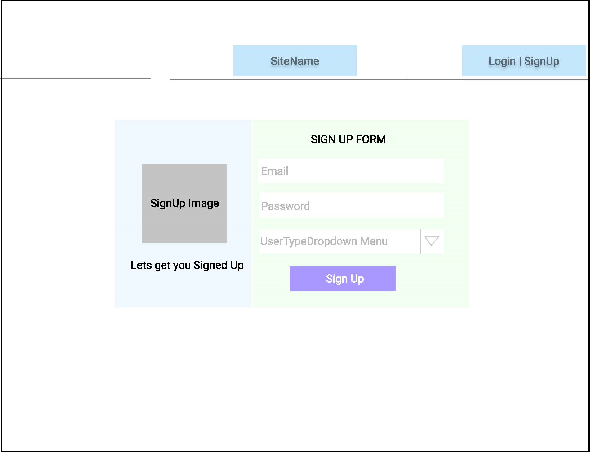

# HomeFinder - Web application (Zillow.com Prototype)

## Group Members:
* Apoorv Mehrotra
* Pranav Karmalkar
* Pranjay Sagar 
* Swapnil Parihar

## Problem Statement
Develop a web application that lets users buy, sell or rent homes(Something like Zillow.com). The project aims at building a web app portal to faciliate the selling/renting of a house. It provides a platform for the below personas to connect
* Landlord <-> Renter
* Buyer <-> Seller
* Realtor

## Design Decisions
#### Part 1: Selection of Tech-Stack
1.	Why MongoDB?
2.	Why NodeJS?
3.	Why LoadBalancer and AWS?
4.	To allow us to create lightweight and dynamic web pages, ReactJS was used in the Frontend. It allowed us to build interactive components like modals, which improved user experience.
5.	Redux ensured consistent behavior throughout the application as a state container and manager. Redux resulted in easy testing and smooth state transitions.

#### Part 2: Front-end Design Decisions
1.	Bootstrap React framework improved the reusability of the code.
2.	Used Modals(Pop-ups) for insertion and updating the forms as they improve user experience and reusability and reduce code lines.
3.	Reused components like listing to reduce the size of the application

#### Part 3: Backend Design Decisions
1. 
2.
3.

## Technology Stack
* React.js and redux for Frontend
* Node.js for Backend
* MongoDB to store and retrieve the persistent data
* AWS for the deployment

## Sample UI WireFrames 
#### Sign-Up WireFrame 

#### Login WireFrame 

## Architecture Diagram 

## Database Schema

## Links for the Software Engineering Boards:
Journal: https://github.com/gopinathsjsu/fa20-cmpe-202-sec-02-team-project-team_3/blob/master/Journal.md

Sprint Sheet: https://github.com/gopinathsjsu/fa20-cmpe-202-sec-02-team-project-team_3/blob/master/SCRUM_Sheet/Team3_SCRUM_Sheet.xlsx

Project Task Board: https://github.com/gopinathsjsu/fa20-cmpe-202-sec-02-team-project-team_3/projects/3

## Directory Structure for the Repository

Backend: 

Frontend: 
Contains code developed in ReactJS developed with Visual Studio Code IDE. The index.js contains the routes for the different components.  The package.json file contains the dependencies needed for the frontend.  Frontend can be started by implementing the commands:

npm -i
npm start

Individual_wireframes:
Contains all wireframes for the project. 

SCRUM_Sheet:
Contains the final SCRUM sheet for the project and the guidelines we developed on how to work using Git Version control collaboratively

Key Files:
API_Documentation.docx: List the various APIs designed for the project and explains their functionality.
Journal.md: Contains the Weekly Scrum Report and XP Core Values practice during the project.
SCRUM_Sheet/Team3_SCRUM_Sheet.xlsx: Contains the time allocation distribution for sprints and the complete Burndown Chart for the project.
Team3.pptx: The PPT for demo
