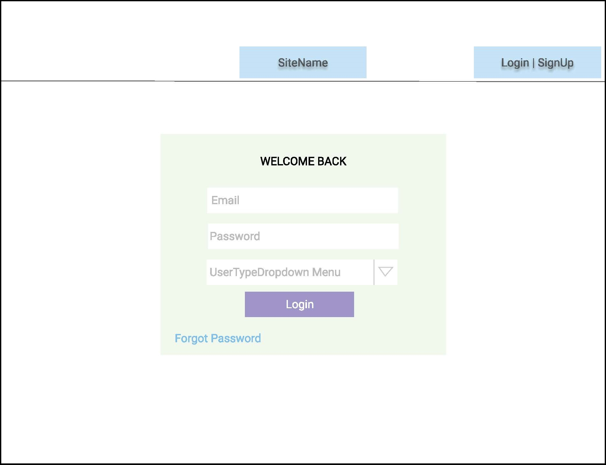

# HomeFinder - Web application (Zillow.com Prototype)

## Group Members:
* Apoorv Mehrotra
* Pranav Karmalkar
* Pranjay Sagar 
* Swapnil Parihar

## Summary of Area of contributions for each team member.
* Apoorv Mehrotra : Cloud Deployment and API development for admin and favorite searches.
* Pranav Karmalkar: Design of filters , favorite properties searches and listing UI
* Pranjay Sagar: Encryption ,Database design and APIs related to listings and properties
* Swapnil Parihar: Design of Task Board, pseudo-SCRUM master  and UI for sign-up, login and admin pages.
* All: API Documentation design discussion
 
## Problem Statement
Develop a web application that lets users buy, sell or rent homes(Something like Zillow.com). The project aims at building a web app portal to faciliate the selling/renting of a house. It provides a platform for the below personas to connect
* Landlord <-> Renter
* Buyer <-> Seller
* Realtor

## Design Decisions
#### Part 1: Selection of Tech-Stack
1.	MongoDB has been used as the database, considering the read centricity of the data. It supports storing the objects as nested documents. It is highly scalable.
2.	NodeJS has been used at the backend. It has fast processing and seamless JSON support which helped in building up the smooth classes and interaction between them. The object destructing property 
3.	To make the application fault tolerant, LoadBalancer is used and the entire project has been deployed on AWS facilitating making it a SaaS serivce.
4.	To allow us to create lightweight and dynamic web pages, ReactJS was used in the Frontend. It allowed us to build interactive components like modals, which improved user experience.
5.	Redux ensured consistent behavior throughout the application as a state container and manager. Redux resulted in easy testing and smooth state transitions.

#### Part 2: Front-end Design Decisions
1.	Bootstrap React framework improved the reusability of the code.
2.	Used Modals(Pop-ups) for insertion and updating the forms as they improve user experience and reusability and reduce code lines.
3.	Reused components like listing to reduce the size of the application

#### Part 3: Backend Design Decisions
1. NodeJS allowed the seamless JSON support that helped in esy accessibility of objects and its attributes. The object destructuring allowed the resuability of the code.
2. Factory design pattern has been implemented that red-directed the flow towards the respetive persona classes.
3. Due care has been taken to keep the code modular and resuable as much as possible.

## Technology Stack (MERN stack)
* React.js and redux for Frontend
* Node.js for Backend
* MongoDB to store and retrieve the persistent data
* AWS for the deployment

## Sample UI WireFrames 

#### Login WireFrame 

## Architecture Diagram 

## Database Schema

## Sample Snapshot of the Project Task Board during project Development

## Links for the Software Engineering Boards:
Journal: https://github.com/gopinathsjsu/fa20-cmpe-202-sec-02-team-project-team_3/blob/master/Journal.md

Sprint Sheet: https://github.com/gopinathsjsu/fa20-cmpe-202-sec-02-team-project-team_3/blob/master/SCRUM_Sheet/Team3_SCRUM_Sheet.xlsx

Project Task Board: https://github.com/gopinathsjsu/fa20-cmpe-202-sec-02-team-project-team_3/projects/3

Git contributions: https://github.com/gopinathsjsu/fa20-cmpe-202-sec-02-team-project-team_3/graphs/contributors

## Feature Set
  The different features of the system are:
  *	Persistent data: The data is stored in Mongo DB and hence is available online.
  * Easy and intuitive UI: The frontend is simple and interactive and is easy to use.
  * Authentication and Authorization: Only the users registered in the system with proper credentials can access the system.
  * Confidentiality: The password is stored in encrypted form in the database.
  * Cloud Deployment: The system can handle many concurrent users due to the use of load balancers during the Cloud Deployment
  * Session Management: We are maintaining the sessions and roles for the users using browser storage.

  The main functionalities of the system are:

  User:
  *	Any new user(Renter, Seller, Landlord, buyer, realtor, and even admin)  can sign-up using a single portal and access the website's content after approval.
  *	A Seller, landlord, and realtor can add new listings for their properties. Various attributes, including but not limited to the house's price, its construction year, date of the open house, and lease agreement specifications for the house, can be specified by the person adding the listing. 
  *	Once posted, these listings can be edited or deleted.
  *	A dynamic text message is generated based on the inputs for a given property that describes the whole property.
  *	A user can add favorite searches and favorite listings and save them. A buyer or a renter can apply for a listing and then wait for the seller, realtor, or landlord's approval.
  *	Sellers, realtors, and buyers have an extra option to view all the properties that they have posted. They can also buy, rent another house if they would want to.
  *	The application provides the user with a search option to browse through all the listings.  This search shows only the listings suited for his/her needs.

  Admin:
  *	Any new Admin can sign up using the same web page as the user.
  *	Any user can be approved or rejected by the administrator
  *	Even after deleting a user, his record is kept in the database so that they cannot re-register unless they contact the admin
  *	To simplify the approval process, we have 'drop-down menus' to filter the pending requests. 
  *	Admin dashboard can only be visible if one login in as an admin. For all other types of users, the property listing page is shown. 

## Overall Burndowm Chart of the Project

## Directory Structure for the Repository

Backend: 

Contains code developed in NodeJS developed with Visual Studio Code IDE. It establishes connection with MongoDB for CRUD operations. The index.js contains the routes for the different personas that incude the separate path for common, admin, realtor, landlord, seller, buyer, renter. The package.json file contains the dependencies needed for the backend.  Frontend can be started by implementing the commands:

npm -i\
nodemon

Frontend: 

Contains code developed in ReactJS developed with Visual Studio Code IDE. The index.js contains the routes for the different components.  The package.json file contains the dependencies needed for the frontend.  Frontend can be started by implementing the commands:

npm -i\
npm start

Individual_wireframes:\
Contains all wireframes for the project.

SCRUM_Sheet:\
Contains the final SCRUM sheet for the project and the guidelines we developed on how to work using Git Version control collaboratively

Key Files:\
API_Documentation.docx: List the various APIs designed for the project and explains their functionality.\
Journal.md: Contains the Weekly Scrum Report and XP Core Values practice during the project.\
SCRUM_Sheet/Team3_SCRUM_Sheet.xlsx: Contains the time allocation distribution for sprints and the complete Burndown Chart for the project.\
Team3.pptx: The PPT for demo
